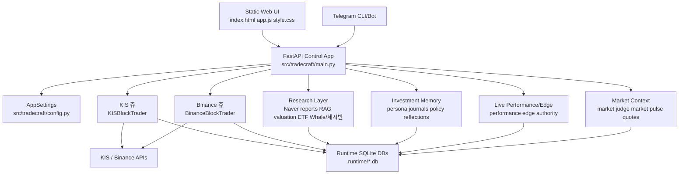
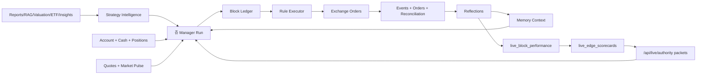
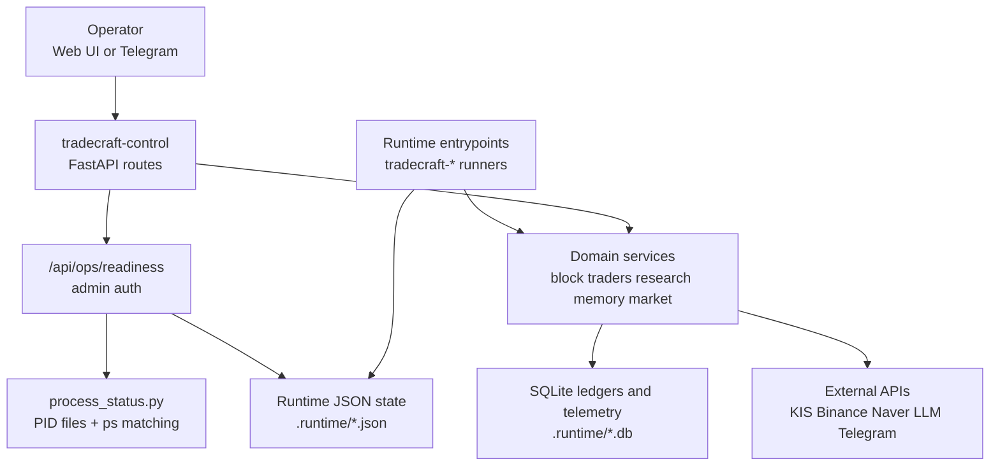

# Architecture

## Layer Overview

The control process is `tradecraft-control` / `tradecraft-ui`, both wired to `tradecraft.main:run` in `pyproject.toml`. It creates the FastAPI app in `src/tradecraft/main.py`, mounts the static UI from `src/tradecraft/web/static`, exposes service APIs, and reads configuration through `AppSettings` in `src/tradecraft/config.py`.

The runtime layer is a set of separate console entrypoints. `tradecraft-kis-block-trader` builds `KISBlockTrader`; `tradecraft-binance-block-trader` builds `BinanceBlockTrader`; `tradecraft-investment-memory`, `tradecraft-live-evaluator`, `tradecraft-market-judge`, `tradecraft-market-pulse`, `tradecraft-research`, `tradecraft-naver-reports`, `tradecraft-strategy-insights`, `tradecraft-crypto-market-research`, `tradecraft-crypto-pattern-lab`, and `tradecraft-crypto-alpha` keep background state fresh for trading decisions and operator visibility.

## Primary Data Flow

Research, strategy, memory, account state, quotes, market context, and venue live-authority packets feed the LLM-backed 쥬 manager runs. Manager runs create or update block intent in the KIS and Binance block ledgers. Deterministic executor ticks then enforce target, stop, entry-trigger, cancellation, precision, cash, exposure, kill-switch, and reconciliation behavior before any exchange order is sent.

Live performance and edge evaluation is a feedback layer. `live_block_performance` separates adopted positions, unfilled failures, risk-management outcomes, execution quality, and Jue-created alpha. `live_edge_scorecards` turns enough venue/strategy/evidence outcomes into `observe_only`, `insufficient`, `restricted`, `qualified`, or `scale_candidate` grades. `/api/live/authority` exposes those grades as per-venue authority packets with `max_budget_multiplier` and `allow_scale_up`; the packet constrains manager sizing/scale decisions but never bypasses exchange or safety gates.

## Control And Runtime Flow

`process_status.py` owns the process keys, labels, PID file names, and command patterns used by the ops view. The current core readiness process map in `main.py` covers `control`, `runtime`, `kis_block_trader`, `binance_block_trader`, `crypto_market_research`, `crypto_alpha`, `investment_memory`, `live_evaluator`, `market_judge`, and `market_pulse`, with code-staleness checks against each runner and service file.

## Design Invariants

- HERMES/쥬 is an active block-trading system; trading identity must stay explicit in UI, API, prompts, memory, and runtime specs.
- Blocks are independent units even when symbols overlap.
- LLM managers produce intent; rule executors and gates enforce execution.
- Safety gates override generated intent before exchange orders are sent.
- Existing KIS holdings and Binance wallet positions can be adopted into blocks without counting them as fresh 쥬 entry orders.
- Live authority can reduce or approve scaling based on evidence, but it cannot grant exchange authority when readiness, kill switch, cash, quantity, leverage, precision, or reconciliation gates fail.
- KIS and Binance are separate trading venues with scoped memory sharing.
- Binance spot and futures share the Binance block runtime but require separate exchange, leverage, liquidation-distance, precision, and exposure constraints.
- Runtime DBs are part of the operational system, not disposable cache.
- Runtime JSON state and PID files are operator evidence, not just internal implementation detail.
- UI should display stale/error/auth states rather than hiding them.

## Refactor-Relevant Boundaries

| Boundary | Current Owner | Why It Matters |
| --- | --- | --- |
| Control app | `src/tradecraft/main.py` | Static UI serving, API route wiring, admin auth, readiness, service construction. |
| Settings | `src/tradecraft/config.py` | Env aliases, live/paper toggles, LLM settings, DB paths, intervals, exchange credentials. |
| Process status | `src/tradecraft/runtime/process_status.py` | Runner identity, PID files, command matching, readiness labels. |
| Runtime state | `src/tradecraft/runtime/state_store.py`, runner `*_state_path` settings | Last-cycle status used by UI and readiness checks. |
| Exchange adapter | `src/tradecraft/services/kis.py`, `src/tradecraft/services/binance.py` | External API normalization, token/cache/rate behavior, account and order shape. |
| Block manager | `src/tradecraft/services/kis_block_trader.py`, `src/tradecraft/services/binance_block_trader.py` | LLM prompt, action schema, validation, block writes. |
| Rule executor | Block trader services | Deterministic target/stop/trigger handling. |
| Memory | `src/tradecraft/services/investment_memory.py`, `src/tradecraft/services/jue_decision_packet.py`, `src/tradecraft/services/block_performance.py` | Long-running learning loop, prompt context, policy rules, block reflections. |
| Live performance/edge | `src/tradecraft/services/live_performance.py`, `src/tradecraft/services/live_edge.py`, `src/tradecraft/services/live_authority.py`, `src/tradecraft/runtime/live_evaluator_runner.py` | Attribution-aware PnL, empirical edge grades, authority packets, evaluator DB/state ownership. |
| Strategy inputs | Strategy, research, valuation, ETF, discovery, and crypto services | Candidate source quality, score interpretation, and venue-specific opportunity filtering. |
| Market context | `src/tradecraft/services/market_judgment.py`, `src/tradecraft/services/market_pulse.py`, quote providers | KRX session clock, market pulse, quote snapshots, account-aware judgments. |
| Codex native runtime | `src/tradecraft/services/codex_native.py`, `src/tradecraft/services/codex_native_store.py`, `src/tradecraft/services/llm_usage.py` | Model routing, native thread/session handling, timeout behavior, reasoning settings, and usage telemetry. |
| Telegram | `src/tradecraft/services/telegram.py`, `src/tradecraft/services/telegram_cli.py`, Telegram webhook route | Operator commands and notification delivery with chat/secret guards. |
| UI fetch/state | `src/tradecraft/web/static/app.js` | Operator visibility, auth, active refresh, dashboard state, trading controls. |
