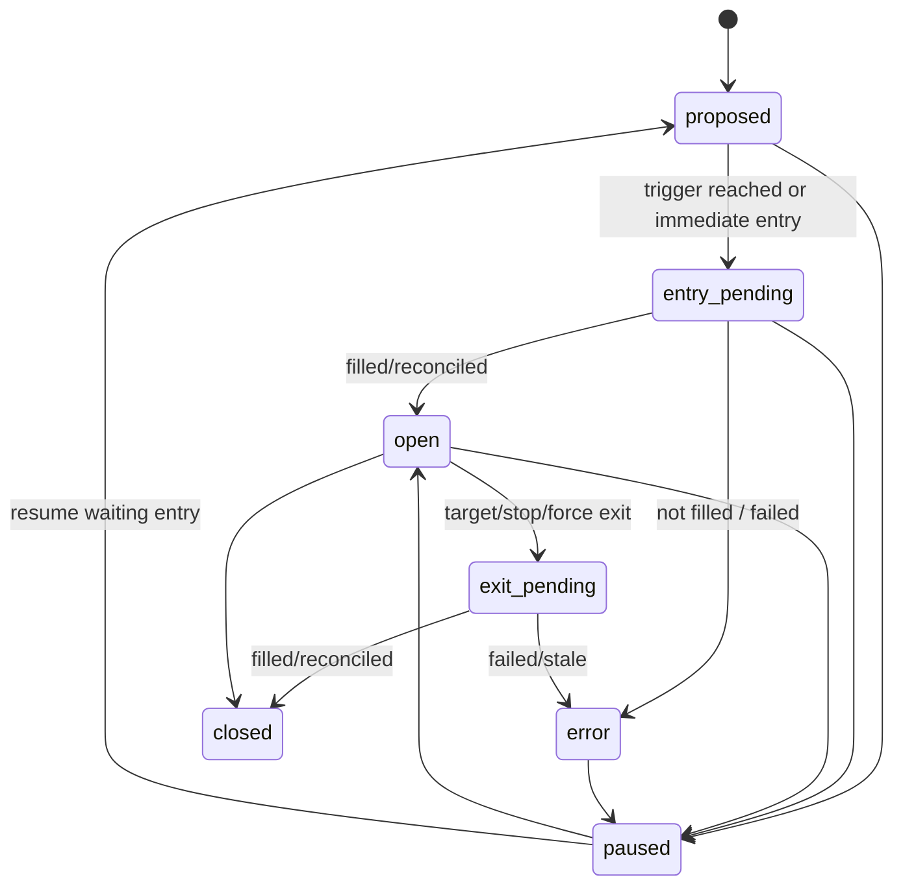

# KIS 쥬

## Purpose

KIS 쥬 manages Korean-stock and ETF block trading for the primary KIS domestic account. It can create, adopt, update, pause, and close blocks, while deterministic rule execution handles target/stop/waiting-entry triggers.

HERMES/쥬 is an active trading identity here: 쥬 proposes block intent, and the
KIS rule/order layer decides whether that intent can become an order under cash,
quantity, duplicate-order, market-session, kill-switch, auth, and reconciliation
guards.

## Core Files

- `src/tradecraft/services/kis.py`
- `src/tradecraft/services/kis_block_trader.py`
- `src/tradecraft/runtime/kis_block_trader_runner.py`
- `src/tradecraft/services/market_judgment.py`
- `src/tradecraft/services/market_pulse.py`

Additional input surfaces include `src/tradecraft/services/jue_decision_packet.py`
for decision packet v2, `src/tradecraft/services/block_performance.py` for path
summaries, `src/tradecraft/services/live_authority.py` for the KIS live
authority packet, and the investment-memory provider used by the KIS block
trader.

## Block Lifecycle

Waiting-entry blocks are represented as `proposed` blocks with
`metadata.entry_style=wait_for_price`, an `entry_trigger_price`, an
`entry_trigger_operator`, and `entry_trigger_status=waiting`. The rule executor
can later move them toward entry without asking the LLM again.

## Manager Actions

| Action | Meaning |
| --- | --- |
| `adopt_existing_blocks` | Convert existing account positions into ledger blocks without buy order. |
| `create_blocks` | Create immediate or waiting-entry blocks. |
| `update_blocks` | Adjust target/stop/thesis/risk metadata. |
| `close_blocks` | Request exit through guarded order flow. |
| `pause_blocks` | Stop active management without deleting history. |

Existing-position adoption uses unallocated KIS account quantity and writes
`created_by='existing_position'`. It records adoption metadata, position and
quote evidence, policy-rule effects, horizon, allocation reason, confidence,
target, stop, and thesis. Adoption intentionally does not submit a buy order.

## Execution Rules

- Open short-horizon blocks can trigger deterministic target/stop exits.
- Mid/long/core ETF blocks may treat target/stop as risk/rebalance signals depending on metadata.
- Waiting-entry blocks are monitored by rule executor without additional LLM calls.
- Cash, available quantity, duplicate order prevention, kill switch, and auth are hard gates.

Immediate KIS entries use current quotes, an aggressive limit price derived from
`TRADECRAFT_KIS_BLOCK_TRADER_AGGRESSIVE_LIMIT_BPS`, and target/stop validation
that requires `stop < reference_price < target`. If live execution is disabled,
blocks can open in paper mode; if live execution is enabled, the block waits in
`entry_pending` until KIS order reconciliation confirms the fill. Exits use
available quantity and order reconciliation in the same ledger: sent,
partially-filled, filled, canceled, stale, and failed states remain visible in
`block_orders` and `block_events`.

KIS quote/order/reconciliation flow:

1. Manager or rule tick gathers KIS account and quote data.
2. Actions are sanitized against symbol format, unallocated quantity, cash,
   target/stop bounds, and known block ids.
3. Entry or exit orders are written to the block-order ledger; live orders call
   KIS domestic order APIs through `KISAdapter`.
4. Pending orders are reconciled through KIS daily order inquiry.
5. Fill reconciliation updates block status, quantity, open/closed timestamps,
   average fill evidence, and events.

## Data Inputs

- KIS account cash, deposits, holdings, PnL, available quantities.
- KIS current quotes and quote snapshots.
- Strategy candidates and valuation.
- ETF research and ETF-as-symbol reports.
- Market pulse: indices, sector flow, investor flow, program trading.
- Investment memory: persona, daily journal, policies, symbol/block notes.
- Live authority packet for KIS grade, scorecards, `max_budget_multiplier`, and
  `allow_scale_up`.
- User directives for special handling.

The manager prompt also receives allocation reconciliation, horizon allocation
targets, pre-adoption symbol analysis, recent block events, previous manager
runs, `decision_packet_v2`, market judgment, daily discovery when present, and
policy-rule evaluations from memory. Memory scope is explicit: local KIS memory
is primary, while Binance-derived memory is only a cross-venue process lesson
unless separately scoped.

## Live Authority Usage

KIS manager prompts should consume the KIS venue packet from `/api/live/authority`
or the equivalent evaluator state. The packet is the maximum evidence-backed
authority for new or expanded KIS blocks:

- `observe_only` or `restricted`: avoid increasing risk unless a hard operator
  directive and fresh evidence justify a tiny waiting-entry or risk-reduction
  action.
- `insufficient`: allow normal review and small exploratory blocks, but do not
  claim proven KIS edge.
- `qualified`: allow baseline budget sizing inside existing KIS cash, session,
  duplicate-order, target/stop, and reconciliation gates.
- `scale_candidate`: allow scaled sizing only up to `max_budget_multiplier` and
  only when `allow_scale_up=true`.

The packet constrains manager discretion. It does not place orders, change
`TRADECRAFT_KIS_BLOCK_TRADER_EXECUTE_ORDERS`, bypass the KIS kill switch,
override account cash/quantity, or make adopted existing-position gains count as
fresh Jue alpha.

## Current Evaluation Caveats

- Separate `created_by='llm'` from `existing_position`.
- Prefer `live_block_performance.include_in_jue_alpha` for aggregate
  Jue-alpha reporting when evaluator rows exist.
- Closed blocks should have reflections before performance evaluation.
- Names may need symbol-directory repair if displayed as code-only.
- Fees/taxes handling should be verified before using performance as exact accounting.

Waiting-entry plans should not be counted as filled exposure until the trigger
fires and the entry order is filled or paper-opened. KIS performance summaries
use quote paths and block prices, so exact tax, fee, slippage, and partial-fill
accounting need reconciliation evidence before they are treated as final
accounting.
