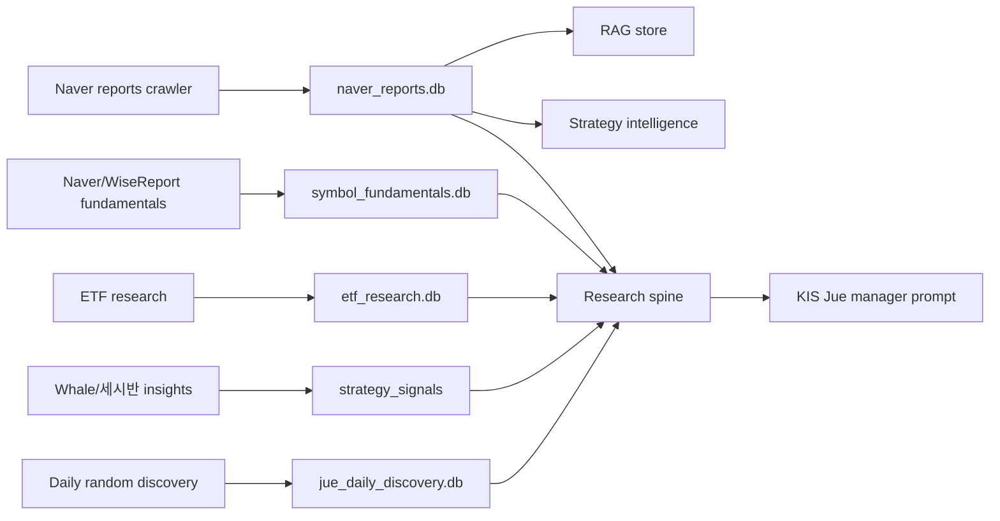
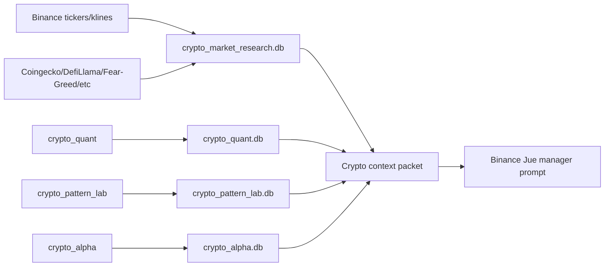

# Research Pipeline Contracts

Research is the evidence supply chain for Jue. This document describes what
each research path collects, how it is persisted, and how it is supposed to
affect KIS and Binance decisions.

## Research Principles

- Research data should become durable DB rows before it becomes Jue context.
- Jue should see compact, ranked, source-labeled packets, not unlimited raw
  documents.
- Every candidate should expose data coverage and data gaps.
- Symbol identity quality is part of research quality.
- External data can be wrong; the system should retain status/error/staleness
  metadata instead of pretending the source is complete.
- Research should not produce orders directly. It produces evidence and
  candidates for manager prompts.

## Korean Equity Research Stack

### Naver Reports

Owner files:

- `src/tradecraft/services/naver_reports.py`
- `src/tradecraft/runtime/naver_reports_runner.py`
- `src/tradecraft/reports_api/**`

Responsibilities:

- Crawl configured Naver Finance research categories.
- Archive PDFs when configured.
- Extract report text and chunks.
- Parse metadata, broker, analyst, publication date, title, category.
- Link reports to symbols and maintain `symbol_directory`.
- Repair symbol/name pollution when stronger evidence exists.
- Feed RAG sync and strategy intelligence.

Required quality behavior:

- Generic names like `정보`, date fragments, HTML fragments, or bare symbols
  should not overwrite known clean KRX names.
- KRX/pykrx-like directory names outrank weak body/title guesses.
- `reports.status`, crawl errors, and RAG sync status must remain visible.
- ETF reports should be treated as symbol-addressable research where possible,
  not as a separate disconnected world.

### RAG Store

Owner files:

- `src/tradecraft/services/rag_store.py`
- Naver report sync routes in `main.py` and reports microservice.

Responsibilities:

- Store searchable report chunks in the configured vector backend.
- Return citation-like references for helper answers and research context.
- Avoid unsafe legacy pickle migration unless explicitly enabled.

Refactor rule:

- RAG is retrieval infrastructure, not the canonical report DB. Canonical
  report metadata remains in `naver_reports.db`.

### Symbol Fundamentals

Owner file:

- `src/tradecraft/services/symbol_fundamentals.py`

Responsibilities:

- Collect Naver/WiseReport valuation and financial snapshots by KRX code.
- Store `valuation_snapshots`, `financial_snapshots`, and
  `valuation_scores`.
- Return valuation labels, score components, reasons, risks, and raw source
  provenance.
- Fail per-symbol without breaking the whole candidate list.

Jue usage:

- KIS manager receives valuation/quality/growth context through strategy
  packets and symbol analysis.
- Low valuation alone is not a buy command. It affects block horizon, sizing,
  target/stop review, and whether a candidate fits pullback/value style.

### ETF Research

Owner file:

- `src/tradecraft/services/etf_research.py`

Responsibilities:

- Keep ETF universe rows.
- Collect ETF price/market snapshots.
- Score relative ETF candidates.
- Feed KIS manager and market judge.

Refactor target:

- ETF should remain compatible with symbol research infrastructure while
  preserving ETF-specific metadata such as theme, index, currency exposure, and
  leverage/inverse risk.

### Strategy Insights

Owner file:

- `src/tradecraft/services/strategy_intelligence.py`

Responsibilities:

- Store external strategy signals in `strategy_signals`.
- Normalize Whale/세시반-like signals into source-labeled rows.
- Feed strategy candidates and research spine.

Important distinction:

- Whale and 세시반 should be independently visible evidence sources. They should
  not be hidden inside a single opaque weighted score. The manager can decide
  how much to trust each source in the context of price, valuation, horizon, and
  current block state.

### Daily Discovery

Owner file:

- `src/tradecraft/services/daily_discovery.py`

Responsibilities:

- Sample KOSPI/KOSDAQ symbols for daily random study.
- Avoid repeatedly sampling the same symbols too soon.
- Trigger instant symbol analysis for discovered names when configured.
- Feed KIS manager as a creative idea source, not as a forced trading list.

## Crypto Research Stack

### Crypto Market Research

Owner files:

- `src/tradecraft/services/crypto_market_research.py`
- `src/tradecraft/runtime/crypto_market_research_runner.py`

Responsibilities:

- Build a liquid crypto universe from configured seeds and top-volume auto
  discovery.
- Store market snapshots, klines, derivatives, features, regime snapshots,
  external context, research runs, symbol notes, and candidates.
- Run feature collection more often than LLM research.
- Feed ranked candidates to Binance Jue.

Key settings:

- `TRADECRAFT_CRYPTO_MARKET_RESEARCH_MAX_SYMBOLS`
- `TRADECRAFT_CRYPTO_MARKET_RESEARCH_AUTO_UNIVERSE_LIMIT`
- `TRADECRAFT_CRYPTO_MARKET_RESEARCH_LLM_TOP_SYMBOLS`
- `TRADECRAFT_CRYPTO_MARKET_RESEARCH_KLINE_INTERVALS`
- `TRADECRAFT_CRYPTO_MARKET_RESEARCH_FEATURE_INTERVAL_SEC`
- `TRADECRAFT_CRYPTO_MARKET_RESEARCH_LLM_INTERVAL_SEC`

### Crypto Quant

Owner file:

- `src/tradecraft/services/crypto_quant.py`

Responsibilities:

- Generate long/short/no-trade signal packets.
- Store signal history and outcomes.
- Provide expected-R, directional score, and trend context.

Refactor target:

- Keep quant features deterministic and separately testable from LLM narratives.

### Crypto Pattern Lab

Owner file:

- `src/tradecraft/services/crypto_pattern_lab.py`

Responsibilities:

- Import strategy files/patterns, including Freqtrade-derived sources.
- Store pattern definitions and local backtest scorecards.
- Run bounded parameter optimization over qualified pattern scorecards.
- Store optimization trials and promoted optimized strategy sets.
- Provide compact scorecard and optimized-parameter context to Binance Jue.

Boundary:

- Pattern lab can supply pattern priors; it should not directly submit orders.
- Optimizer output is a price-geometry prior. It can suggest `stop_pct`,
  `target_pct`, and `holding_bars`, but Binance Jue and the rule executor still
  perform current-book, spread, funding, exchange-filter, liquidation, exposure,
  and kill-switch checks before any block can trade.

### Crypto Alpha

Owner file:

- `src/tradecraft/services/crypto_alpha.py`

Responsibilities:

- Crawl configured external source ids.
- Store event snapshots, symbol links, outcomes, hypotheses, and context cache.
- Label due outcomes so future decisions can learn from event quality.

## Research Spine Contract

Owner file:

- `src/tradecraft/services/jue_research_spine.py`

Purpose:

- Combine reports, RAG, valuation, ETF, insights, market pulse, and discovery
  into balanced packets.
- Prevent one source class, such as ETFs or a single signal feed, from crowding
  out equities or other evidence.
- Attach coverage, warnings, and source buckets.

Required output qualities:

- preserve symbol/name identity;
- expose source coverage;
- keep stale/missing/error flags;
- include both supporting and contradictory evidence where available;
- keep packet size within manager prompt limits.

## Instant Symbol Analysis Contract

Owner files:

- `src/tradecraft/services/symbol_analysis.py`
- memory table `symbol_analyses`

Use cases:

- User buys a stock and asks Jue to treat it specially.
- A new position appears and needs adoption context.
- Daily discovery finds an unfamiliar symbol.
- A manager run needs deeper symbol-specific context.

The analysis should store:

- short/mid/long view;
- stance;
- confidence;
- reasons;
- risks;
- data gaps;
- trigger conditions;
- target/stop candidates;
- raw evidence snapshot.

## Research-To-Trading Contract

Research affects trading through these channels:

1. Strategy candidate lists.
2. Research spine packets.
3. Symbol fundamentals/analysis.
4. ETF research packets.
5. Crypto research/quant/alpha/pattern context.
6. Memory reflections and policy rules.

Research must not create orders by itself, rewrite block ledgers, hide source
errors, replace exchange quotes for execution, or count old wallet/adopted PnL
as Jue-created alpha.

## Tests Required For Research Changes

- Reports/RAG: `tests/test_naver_reports.py`,
  `tests/test_naver_reports_runner.py`, `tests/test_rag_store.py`,
  `tests/test_reports_api.py`, `tests/test_reports_microservice_*.py`.
- Fundamentals/ETF: `tests/test_symbol_fundamentals.py`,
  `tests/test_symbol_analysis.py`, `tests/test_etf_research.py`,
  `tests/test_etf_research_api.py`.
- Strategy/research spine: `tests/test_strategy_intelligence.py`,
  `tests/test_jue_research_spine.py`, `tests/test_research_pipeline.py`,
  `tests/test_research_runner.py`.
- Crypto research: `tests/test_crypto_market_research.py`,
  `tests/test_crypto_quant.py`, `tests/test_crypto_pattern_lab.py`,
  `tests/test_crypto_alpha.py`.
