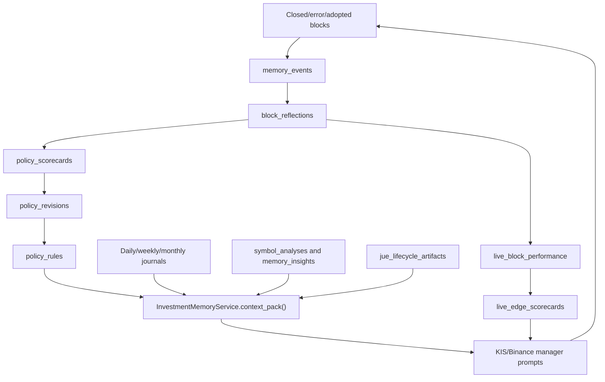

# Memory & Learning Contracts

Jue's memory system is designed to make trading behavior improve over time. It
is not model fine-tuning. It is local structured memory, provenance, reflection,
policy scoring, and prompt/context injection.

## Memory Architecture

## Markdown Memory Layout

Root path defaults to `.runtime/investment_memory/`.

| Path | Purpose |
| --- | --- |
| `persona.md` | Jue's operator-facing identity, tone, and decision posture. |
| `policies/init.md` | Initial memory creation policy. |
| `policies/update.md` | How new evidence is compressed into memory. |
| `policies/trading.md` | Trading-policy principles and safety gate reminders. |
| `policies/telegram.md` | Telegram message style and cadence. |
| `journals/YYYY-MM-DD/pre_open.md` | Pre-open mindset and plan. |
| `journals/YYYY-MM-DD/midday.md` | Intraday check. |
| `journals/YYYY-MM-DD/post_close.md` | Market close review. |
| `journals/YYYY-MM-DD/block_reflection.md` | Daily block reflection rollup. |
| `symbols/{code}.md` | Symbol-specific memory. |
| `sectors/{name}.md` | Sector-specific memory. |
| `regimes/{name}.md` | Market-regime memory. |
| `blocks/{block_id}.md` | Block-specific lesson. |

Markdown is for human readability and prompt compression. SQLite remains the
dedupe/provenance/API source.

## Daily Ritual Contract

| Slot | Default Time | Purpose | Required Inputs |
| --- | --- | --- | --- |
| `pre_open` | 08:30 KST | Mindset, account posture, open blocks, watch ideas, today constraints. | Account, blocks, research spine, memory policies, previous review. |
| `midday` | 11:40 KST | Intraday check, block pressure, market pulse, overtrading warning, plan validity. | Quotes, block PnL, market pulse, morning plan. |
| `post_close` | 15:45 KST | Day result, block events, mistakes, next-day memory seeds. | Closed/open blocks, market data, manager runs, reflections. |

Rituals should be idempotent per trading day and slot unless `force=true`.
Telegram sends are deduped by `telegram_sends(trading_day, slot)`.

## Reflection Contract

Reflection is required for closed blocks, error blocks, stale/canceled order
situations, manual close, wallet/existing-position adoption that later closes,
unusually large MFE/MAE divergence, and policy-violating behavior.

Each reflection should separate entry thesis, actual entry evidence,
target/stop design, price path, MFE/MAE, hold time, exit reason, rule
compliance, operational errors, lesson, and candidate policy update.

If a block was created, adjusted, rejected, or closed under a Live Authority
validation gate, the reflection must preserve the compact gate context in
`metrics.live_authority` and mention the relevant failure in `lesson_md`.
Required fields include the validation gate status/readiness/reason, failed
disciplines, capacity bottleneck, and operator guidance when present. This keeps
Jue from learning only "the block won/lost" while forgetting that Monte Carlo,
stress, capacity, or data validation had already constrained the action.

The same failed 19-discipline rows must also create discipline-specific policy
scorecard groups named `validation.{discipline_id}`. For example, repeated
`capacity_analysis` failures become `validation.capacity_analysis`, and repeated
`monte_carlo` failures become `validation.monte_carlo`. These scorecards are
learning signals, not hard filters. When promoted to an active caution rule, the
effect should reduce or delay entry, request a validation review, and force
target/stop scrutiny while keeping `hard_filter=false`.

Reflections must avoid simplistic labels such as "bad stock" when the evidence
actually points to timing, liquidity, sizing, stop placement, or market-regime
failure.

## Policy Rule Contract

Policy rules are versioned and stored in `policy_rules`.

Allowed policy actions:

- `observe`;
- `prefer`;
- `caution`;
- `size_adjust`;
- `target_stop_review`;
- `evidence_request`.

Disallowed as learned strategy policy:

- hidden hard bans;
- unconditional buy;
- unconditional sell;
- exchange-gate bypass;
- disabling reconciliation;
- increasing leverage beyond configured limits.

Hard behavior belongs only to safety gates, not learned policy.

## Policy Promotion Contract

| Stage | Minimum Evidence | Effect |
| --- | --- | --- |
| Candidate observation | One reflection or review identifies a repeatable pattern. | Visible in memory, not strongly applied. |
| Active caution | Repeated evidence with enough confidence and no contradictory outcome. | Manager sees caution and should address it. |
| Active preference | Enough samples and positive expectancy or loss-avoidance evidence. | Manager can prefer sizing/horizon/entry design. |
| Retired | Later evidence shows it stopped helping or was too broad. | Remains in provenance but not active context. |

Policy scorecards should use samples, win rate, expectancy, rule-follow rate,
helped/hurt counts, and confidence. The exact thresholds can evolve, but the
system must store the evidence used for promotion.

## Live Edge Contract

Memory policy scorecards and live edge scorecards are different layers:

- `policy_scorecards` explain whether a lesson or behavioral rule helped Jue.
- `live_edge_scorecards` explain whether a venue/strategy/evidence lane has
  enough empirical trading edge to allow normal authority, restrict authority,
  or consider capped scale-up.

`live_block_performance` is the attribution bridge. It should separate
Jue-created alpha from adopted KIS positions, adopted Binance wallet positions,
pre-fill operational failures, unfilled/unrealized outcomes, and execution
quality records. `live_edge_scorecards` should use those normalized outcomes
when judging `expectancy_pct`, `win_rate`, `rule_follow_rate`,
`execution_error_rate`, and drawdown.

The KIS/Binance manager prompt should receive the resulting authority packet as
a current venue constraint. This does not turn learned policy into a hard safety
gate and does not let scorecards bypass exchange, cash, leverage, kill-switch,
or reconciliation checks.

## Jue Wiki Applied Intelligence Contract

The wiki application loop links selected knowledge to later decisions and
outcomes. It must remain scoped and auditable:

| Table | Purpose |
| --- | --- |
| `wiki_decision_links` | Joins a `selection_run_id` to a manager run, market judgment, symbol, block id, venue, horizon, action, prompt mode, and selected page ids. |
| `wiki_selection_outcomes` | Stores page-level realized outcomes such as closed-block result, return percentage, MFE/MAE, hold time, and evidence JSON. |
| `wiki_page_effectiveness` | Aggregates samples into win rate, expectancy, drawdown pressure, helpful score, confidence, and status by page/scope/venue/horizon. |
| `wiki_mode_recommendations` | Produces advisory observe/assist/primary recommendations by scope after enough evidence exists. |

Managers should persist compact `jue_wiki_application` metadata in prompt JSON:
`selection_run_id`, `prompt_mode`, selected page ids, and budget report. This
metadata is an attribution bridge. It should not contain the full page text and
should not replace the source references stored on wiki pages.

Effectiveness may influence future page ranking only through bounded selector
adjustments. Low-sample pages remain `probe`. Degraded pages may be demoted in
selection and surfaced to the operator, but learned wiki effectiveness must not
become a hard ban or order permission. Venue hard gates remain separate.

## Historical Replay Contract

Historical replay lets Jue review prior cases as-of a past date, then update
memory based on what was learnable at that time.

Required behavior:

- Use historical blocks, reports, market context, and memory as-of the replay
  period where possible.
- Do not leak future price outcomes into the decision section.
- Use future outcomes only in the review section.
- Store replay cases in `historical_replays`.
- Convert repeated lessons into candidate policy revisions, not silent prompt
  edits.

Weekly replay is the default cadence. Monthly replay should compress broader
regime and policy behavior.

## Decision Lifecycle Artifacts

`jue_lifecycle_artifacts` store analyst-grade work products:

- morning notes;
- symbol deep dives;
- earnings updates;
- sector rotation notes;
- valuation model updates;
- portfolio rebalance reviews;
- rejected ideas.

These artifacts are not a separate research lab. They feed the same Jue manager
context through `decision_lifecycle_v3`.

## Context Pack Contract

`InvestmentMemoryService.context_pack()` must produce compact, scoped context:

- persona summary;
- active policies;
- recent daily journal;
- relevant symbol notes;
- relevant block notes;
- recent reflections;
- policy scorecard highlights;
- lifecycle artifacts;
- scoped cross-venue lessons.

Scope rules:

- KIS managers get KIS/local memories first.
- Binance managers get Binance/crypto memories first.
- Cross-venue lessons are process-level only unless explicitly scoped.
- The context must respect configured character limits.

## Jue Wiki Contract

`InvestmentMemoryService.context_pack()` may include `jue_wiki`. This field is compiled knowledge, not source-of-truth. Source-of-truth remains report/RAG stores, KIS/Binance block ledgers, live performance/edge stores, and `investment_memory.db`.

Phase 2 adds an explicit selection, repair, and playbook-performance contract
around that compiled knowledge:

- `wiki_selection_runs` records each selector request, target scope, selected
  count, rejected count, prompt character count, budget, status, error, and
  timestamp.
- `wiki_selection_pages` records page rank, score, reasons, penalties, character
  count, and inclusion state for the selection run.
- `wiki_repair_actions` records how open lint findings were handled, including
  rebuild scheduling and unresolved manual findings.
- `wiki_playbook_metrics` records scoped playbook performance projections:
  sample count, win rate, expectancy, profit factor, max drawdown, average
  holding time, status, reasons, and update time.

Manager prompts should treat selector output as a compact interpretation layer.
`observe` mode records selection traces without changing prompt authority.
`assist` mode includes selected pages beside existing raw context caps.
`primary` mode makes selected pages the first knowledge packet but still
requires bounded source evidence for claims that affect orders, sizing, target,
stop, or risk. No prompt mode lets wiki pages override live reconciliation,
exchange gates, order ledgers, report/RAG provenance, block performance, or
memory DB policy history.

The repair loop must keep lint findings observable. Stale pages, missing source
references, oversized pages, and weak provenance should become lint findings and
repair actions, not hidden prompt edits. The playbook compiler and performance
projector may summarize reflection lessons, validation failures, and realized
outcomes, but the original block reflections and performance rows remain the
audit source.

## Native Codex Memory vs HERMES Memory

Native Codex sessions can preserve conversational continuity and compact thread
context. HERMES memory is still the durable trading memory.

| Memory Layer | Owner | Role |
| --- | --- | --- |
| Codex native threads | `codex_native_threads.db` plus Codex app sessions | Per-component reasoning workspace and SDK continuity. |
| HERMES memory DB | `investment_memory.db` | Durable learning, policy, reflections, journals, lifecycle artifacts. |
| Markdown memory | `.runtime/investment_memory/` | Human-readable memory and prompt material. |

Refactors should not assume Codex native session history replaces HERMES memory.
The manager prompt must explicitly receive the relevant memory context.

## Failure Contract

- If memory LLM fails, record `memory_runs.status='error'`.
- Do not fabricate a ritual, review, or policy.
- Do not let memory update failure trigger orders.
- Do not let one broken block reflection block all future reflections; record
  per-event errors.
- Large prompt snapshots should be compacted before storage to prevent runaway
  DB growth.

## Tests Required For Memory Changes

- `tests/test_investment_memory.py`
- `tests/test_investment_memory_api.py`
- `tests/test_block_performance.py`
- `tests/test_jue_lifecycle.py`
- `tests/test_jue_decision_packet.py`
- `tests/test_evidence_policy.py`
- `tests/test_prompt_identity.py`
