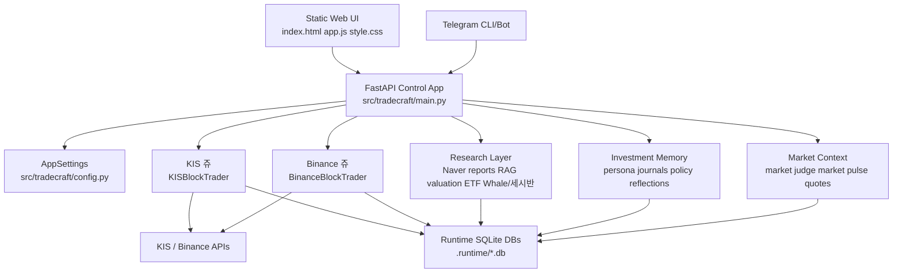
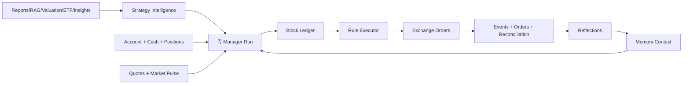
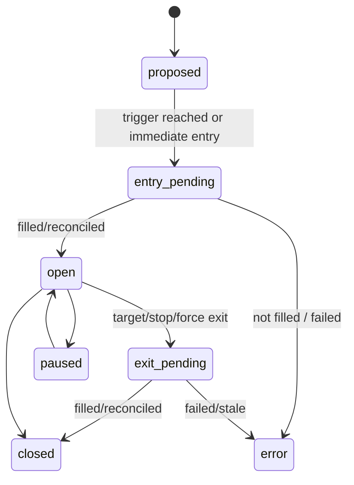

# HERMES Specbook Implementation Plan

> **For agentic workers:** REQUIRED SUB-SKILL: Use superpowers:subagent-driven-development (recommended) or superpowers:executing-plans to implement this plan task-by-task. Steps use checkbox (`- [ ]`) syntax for tracking.

**Goal:** Build a deeply detailed `docs/spec/` specbook that captures the current HERMES/쥬 system well enough to guide future refactoring, operations, and regression checks.

**Architecture:** This is a documentation-first project. The specbook will be split into focused Markdown files by domain: identity, architecture, runtime processes, databases, LLM, KIS 쥬, Binance 쥬, research/memory, UI, API, config, security, observability, known gaps, and refactor roadmap. Every claim should be grounded in current source files, runtime DB schemas, logs, or documented commands.

**Tech Stack:** Markdown, Mermaid diagrams, shell/sqlite inspection commands, pytest/API smoke references, static frontend references, FastAPI route inventory, SQLite runtime DB schema snapshots.

---

## File Structure

Create the following files:

- `docs/spec/README.md`: Specbook index, reading order, maintenance rules.
- `docs/spec/00_product_identity.md`: HERMES/쥬 identity, active trading partner model, boundaries, terminology.
- `docs/spec/01_current_inventory.md`: Source tree, runtime entrypoints, active services, DBs, logs, UI surfaces.
- `docs/spec/02_architecture.md`: Layered architecture, Mermaid diagrams, data/control flow.
- `docs/spec/03_runtime_processes.md`: Runners, schedules, process status, restart order.
- `docs/spec/04_databases.md`: Runtime SQLite DB catalog, table responsibilities, data retention, provenance.
- `docs/spec/05_llm_system.md`: CodexNativeRuntime, model routing, GPT-5.5, Spark, reasoning, timeout, prompt inputs.
- `docs/spec/06_kis_ju.md`: KIS 쥬 block trading, account handling, quote/order flow, rule executor, reflections.
- `docs/spec/07_binance_ju.md`: Binance 쥬 spot/futures block trading, Spark manager, crypto research, quant/pattern layers.
- `docs/spec/08_research_memory.md`: Naver reports, RAG, strategy knowledge, investment memory, persona, daily rituals.
- `docs/spec/09_strategy_intelligence.md`: Suitability v2, valuation, ETF, Whale/세시반, daily discovery, market pulse.
- `docs/spec/10_ui.md`: Static web UI, main dashboard, investment helper, block trading tabs, settings.
- `docs/spec/11_api_reference.md`: Main API groups, auth requirements, payload shape summaries.
- `docs/spec/12_config_env.md`: Env/settings catalog, safe defaults, real-trading toggles.
- `docs/spec/13_security_ops.md`: Admin token, Telegram guards, SSRF controls, operational safety gates.
- `docs/spec/14_observability.md`: Logs, LLM usage telemetry, readiness, DB inspection, weekly review commands.
- `docs/spec/15_known_gaps.md`: Known weaknesses, stale naming, accounting caveats, refactor risks.
- `docs/spec/16_refactor_roadmap.md`: Suggested refactor phases and acceptance criteria.
- `docs/spec/appendix/commands.md`: Reusable inspection commands.
- `docs/spec/appendix/db_schema_snapshots.md`: Captured `.schema` summaries for runtime DBs.
- `docs/spec/appendix/api_route_inventory.md`: Captured API route inventory.

Do not edit application behavior in this documentation pass.

---

### Task 1: Create Specbook Skeleton

**Files:**
- Create: `docs/spec/README.md`
- Create: `docs/spec/00_product_identity.md`
- Create: `docs/spec/appendix/commands.md`

- [ ] **Step 1: Create directories**

Run:

```bash
mkdir -p docs/spec/appendix
```

Expected: command exits with status `0`.

- [ ] **Step 2: Write `docs/spec/README.md`**

Use this exact starting structure:

```markdown
# HERMES / 쥬 Specbook

This specbook describes the current HERMES system as implemented in this repository and local runtime. It is intended to be detailed enough to support future refactoring, operational debugging, and trading-system review.

## Reading Order

1. [Product Identity](00_product_identity.md)
2. [Current Inventory](01_current_inventory.md)
3. [Architecture](02_architecture.md)
4. [Runtime Processes](03_runtime_processes.md)
5. [Databases](04_databases.md)
6. [LLM System](05_llm_system.md)
7. [KIS 쥬](06_kis_ju.md)
8. [Binance 쥬](07_binance_ju.md)
9. [Research & Memory](08_research_memory.md)
10. [Strategy Intelligence](09_strategy_intelligence.md)
11. [UI](10_ui.md)
12. [API Reference](11_api_reference.md)
13. [Config & Env](12_config_env.md)
14. [Security & Ops](13_security_ops.md)
15. [Observability](14_observability.md)
16. [Known Gaps](15_known_gaps.md)
17. [Refactor Roadmap](16_refactor_roadmap.md)

## Source of Truth Rules

- Prefer current source code over memory.
- Prefer runtime DB schema and logs over guesses.
- Mark unverified behavior as `검증 필요`.
- Record command output summaries, not huge raw dumps.
- Keep active-trading identity explicit: HERMES/쥬 is an active block-trading system with safety gates.

## Maintenance Rules

- Update this spec when adding a runner, API group, DB, trading gate, LLM prompt surface, or UI tab.
- When behavior and spec disagree, fix either the implementation or the spec before large refactors.
- Keep refactor proposals in `16_refactor_roadmap.md`; keep observed problems in `15_known_gaps.md`.
```

- [ ] **Step 3: Write `docs/spec/00_product_identity.md`**

Use this exact starting structure:

```markdown
# Product Identity

## One Sentence

HERMES is an active trading partner system where 쥬 manages KIS and Binance block-trading decisions, while deterministic rule executors and safety gates handle order execution constraints.

## Core Characters

### HERMES

The full project: web UI, runtime runners, exchange adapters, research pipelines, memory, strategy intelligence, block ledgers, and operational controls.

### 쥬

The trading partner persona used by the LLM-backed managers. 쥬 reads research, memory, account state, block state, market context, and strategy signals, then proposes or updates trading blocks.

## Non-Negotiable Execution Model

- LLM managers decide block intent.
- Rule executors monitor open blocks without extra LLM calls.
- Safety gates override all generated intent.
- Block ledgers are the operational unit, not only account-level positions.
- Existing holdings can be adopted into blocks without sending buy orders.
- KIS and Binance share memory/process lessons only where explicitly scoped.

## Important Terms

| Term | Meaning |
| --- | --- |
| Block | Independent trading unit with symbol, quantity, entry, target, stop, status, thesis, and events. |
| Open Block | A block currently holding risk or awaiting rule-based management. |
| Waiting Entry Block | A proposed block that should enter only when a price trigger is reached. |
| Manager Run | LLM-backed review cycle that creates, updates, pauses, closes, or adopts blocks. |
| Rule Tick | Deterministic executor pass that checks target/stop/trigger conditions. |
| Memory | Local Markdown + SQLite provenance used to improve future decisions. |
| Safety Gate | Non-negotiable system guard such as kill switch, cash check, quantity check, duplicate-order prevention, auth, and rate limiting. |
```

- [ ] **Step 4: Write `docs/spec/appendix/commands.md`**

Use this exact starting structure:

```markdown
# Inspection Commands

Run all commands from repository root: `/Users/juhwan/hermes_v2`.

## Git & Source Inventory

```bash
git status --short
rg --files src/tradecraft tests docs | sort
rg -n "def .*\\(|class .*\\(|@app\\.|APIRouter|add_api_route" src/tradecraft
```

## Runtime Files

```bash
find .runtime -maxdepth 2 -type f | sort
find .runtime/pids -maxdepth 1 -type f -print -exec cat {} \\;
```

## SQLite Tables

```bash
for db in .runtime/*.db; do echo "### $db"; sqlite3 "$db" ".tables"; done
```

## Focused DB Schemas

```bash
sqlite3 .runtime/kis_blocks.db ".schema"
sqlite3 .runtime/binance_blocks.db ".schema"
sqlite3 .runtime/investment_memory.db ".schema"
sqlite3 .runtime/market_judgment.db ".schema"
sqlite3 .runtime/naver_reports.db ".schema"
sqlite3 .runtime/llm_usage.db ".schema"
```

## Focused Tests

```bash
pytest tests/test_api_smoke.py
pytest tests/test_kis_block_trader.py
pytest tests/test_binance_block_trader.py
pytest tests/test_investment_memory.py
pytest tests/test_market_judgment.py
node --check src/tradecraft/web/static/app.js
```
```

- [ ] **Step 5: Commit skeleton**

Run:

```bash
git add docs/spec/README.md docs/spec/00_product_identity.md docs/spec/appendix/commands.md
git commit -m "docs: start hermes specbook"
```

Expected: one documentation commit. If this repository is not ready for commits, skip the commit and record the reason in the handoff.

---

### Task 2: Write Current Inventory

**Files:**
- Create: `docs/spec/01_current_inventory.md`
- Modify: `docs/spec/appendix/commands.md`

- [ ] **Step 1: Capture source inventory**

Run:

```bash
rg --files src/tradecraft | sort > /tmp/hermes_source_files.txt
rg --files tests | sort > /tmp/hermes_test_files.txt
rg --files docs | sort > /tmp/hermes_doc_files.txt
```

Expected: three temporary inventory files.

- [ ] **Step 2: Capture runtime inventory**

Run:

```bash
find .runtime -maxdepth 1 -type f | sort > /tmp/hermes_runtime_files.txt
find .runtime/pids -maxdepth 1 -type f -print -exec cat {} \; > /tmp/hermes_pid_files.txt
```

Expected: runtime DB/log/json/pid inventory is captured.

- [ ] **Step 3: Write `docs/spec/01_current_inventory.md`**

Use this exact structure and fill each table from the captured inventories:

```markdown
# Current Inventory

## Repository Scope

Primary app code lives under `src/tradecraft`. Tests live under `tests`. Static UI lives under `src/tradecraft/web/static`.

## Major Source Modules

| Area | Files | Responsibility |
| --- | --- | --- |
| App/API | `src/tradecraft/main.py`, `src/tradecraft/config.py` | FastAPI app setup, settings, route wiring. |
| KIS | `src/tradecraft/services/kis.py`, `src/tradecraft/services/kis_block_trader.py` | KIS account, quotes, orders, block ledger, manager, executor. |
| Binance | `src/tradecraft/services/binance.py`, `src/tradecraft/services/binance_block_trader.py`, `src/tradecraft/services/binance_risk.py` | Binance account, spot/futures orders, block ledger, manager, risk controls. |
| Research | `src/tradecraft/services/naver_reports.py`, `src/tradecraft/services/rag_store.py`, `src/tradecraft/services/research_pipeline.py` | Report collection, vector/RAG store, research pipeline. |
| Strategy | `src/tradecraft/services/strategy_intelligence.py`, `src/tradecraft/services/symbol_analysis.py`, `src/tradecraft/services/etf_research.py` | Candidate generation, valuation, ETF analysis, strategy scoring. |
| Memory | `src/tradecraft/services/investment_memory.py` | Persona, journals, policy rules, reflections, context packs. |
| Market Context | `src/tradecraft/services/market_judgment.py`, `src/tradecraft/services/market_pulse.py` | KIS market judgment loop, macro/flow pulse. |
| Crypto Research | `src/tradecraft/services/crypto_market_research.py`, `src/tradecraft/services/crypto_quant.py`, `src/tradecraft/services/crypto_pattern_lab.py`, `src/tradecraft/services/crypto_alpha.py` | Crypto source collection, quant signals, pattern extraction, alpha DB. |
| UI | `src/tradecraft/web/static/index.html`, `src/tradecraft/web/static/app.js`, `src/tradecraft/web/static/style.css` | Static web dashboard and investment helper UI. |
| Telegram | `src/tradecraft/services/telegram_cli.py` | Bot commands and operator interaction. |

## Runtime Entrypoints

| Entrypoint | Source | Role |
| --- | --- | --- |
| `tradecraft-control` | inspect `pyproject.toml` | Main control web app. |
| `tradecraft-kis-block-trader` | `src/tradecraft/runtime/kis_block_trader_runner.py` | KIS block manager/executor runtime. |
| `tradecraft-binance-block-trader` | `src/tradecraft/runtime/binance_block_trader_runner.py` | Binance spot/futures block runtime. |
| `tradecraft-investment-memory` | `src/tradecraft/runtime/investment_memory_runner.py` | Memory rituals, reflections, policy updates. |
| `tradecraft-market-judge` | `src/tradecraft/runtime/market_judge_runner.py` | KIS market judgment schedule. |
| `tradecraft-market-pulse` | `src/tradecraft/runtime/market_pulse_runner.py` | Korean market pulse collection. |
| `tradecraft-crypto-market-research` | `src/tradecraft/runtime/crypto_market_research_runner.py` | Crypto research collection. |
| `tradecraft-crypto-pattern-lab` | `src/tradecraft/runtime/crypto_pattern_lab_runner.py` | Crypto strategy pattern ingestion/backtest. |
| `tradecraft-crypto-alpha` | `src/tradecraft/runtime/crypto_alpha_runner.py` | Crypto alpha scoring and DB update. |

## Runtime DBs

| DB | Role |
| --- | --- |
| `.runtime/kis_blocks.db` | KIS block ledger, orders, events, quotes, reconciliation. |
| `.runtime/binance_blocks.db` | Binance block ledger, orders, events, quotes, performance reflections. |
| `.runtime/investment_memory.db` | Memory runs, journals, insights, block reflections, policy scorecards. |
| `.runtime/market_judgment.db` | KIS account snapshots, quotes, judgment runs, symbol judgments. |
| `.runtime/market_pulse.db` | Korean market regime/pulse snapshots. |
| `.runtime/naver_reports.db` | Naver report metadata, report corpus, symbol directory. |
| `.runtime/symbol_fundamentals.db` | Naver/WiseReport valuation and financial snapshots. |
| `.runtime/etf_research.db` | ETF universe, snapshots, scores. |
| `.runtime/llm_usage.db` | LLM usage telemetry. |
| `.runtime/crypto_market_research.db` | Crypto research sources and normalized items. |
| `.runtime/crypto_quant.db` | Crypto quant signal snapshots and outcomes. |
| `.runtime/crypto_pattern_lab.db` | Imported public strategy patterns and scorecards. |
| `.runtime/crypto_alpha.db` | Crypto alpha signals and summaries. |

## Known Inventory Caveats

- The worktree may be dirty; do not assume all untracked files are accidental.
- Runtime DBs are local operational state and may be large.
- Some historical records preserve older prompt wording or legacy assumptions.
- Binance wallet adoption records must be separated from 쥬-created block performance.
```

- [ ] **Step 4: Verify inventory paths exist**

Run:

```bash
python3 - <<'PY'
from pathlib import Path
doc = Path("docs/spec/01_current_inventory.md").read_text()
paths = [
    "src/tradecraft/main.py",
    "src/tradecraft/config.py",
    "src/tradecraft/services/kis_block_trader.py",
    "src/tradecraft/services/binance_block_trader.py",
    "src/tradecraft/services/investment_memory.py",
    "src/tradecraft/web/static/app.js",
]
missing = [p for p in paths if p not in doc or not Path(p).exists()]
assert not missing, missing
print("inventory path check ok")
PY
```

Expected: `inventory path check ok`.

- [ ] **Step 5: Commit current inventory**

Run:

```bash
git add docs/spec/01_current_inventory.md docs/spec/appendix/commands.md
git commit -m "docs: inventory hermes runtime and source tree"
```

Expected: one documentation commit, unless commits are intentionally deferred.

---

### Task 3: Write Architecture and Runtime Process Specs

**Files:**
- Create: `docs/spec/02_architecture.md`
- Create: `docs/spec/03_runtime_processes.md`

- [ ] **Step 1: Inspect route and runner wiring**

Run:

```bash
rg -n "def .*\\(|async def .*\\(|@app\\.|settings\\.|entry_points|console_scripts" pyproject.toml src/tradecraft/main.py src/tradecraft/runtime src/tradecraft/config.py > /tmp/hermes_runtime_wiring.txt
```

Expected: `/tmp/hermes_runtime_wiring.txt` contains route/runner/settings references.

- [ ] **Step 2: Write `docs/spec/02_architecture.md`**

Use this exact structure:

```markdown
# Architecture

## Layer Overview



## Primary Data Flow



## Design Invariants

- Blocks are independent units even when symbols overlap.
- LLM managers produce intent; rule executors and gates enforce execution.
- KIS and Binance are separate trading venues with scoped memory sharing.
- Runtime DBs are part of the operational system, not disposable cache.
- UI should display stale/error/auth states rather than hiding them.

## Refactor-Relevant Boundaries

| Boundary | Current Owner | Why It Matters |
| --- | --- | --- |
| Exchange adapter | `kis.py`, `binance.py` | External API normalization, token/cache/rate behavior. |
| Block manager | `kis_block_trader.py`, `binance_block_trader.py` | LLM prompt, action schema, validation, block writes. |
| Rule executor | Block trader services | Deterministic target/stop/trigger handling. |
| Memory | `investment_memory.py` | Long-running learning loop and prompt context. |
| Strategy inputs | strategy/research services | Candidate source quality and score interpretation. |
| UI fetch/state | `web/static/app.js` | Operator visibility, auth, active refresh. |
```

- [ ] **Step 3: Write `docs/spec/03_runtime_processes.md`**

Use this exact structure:

```markdown
# Runtime Processes

## Process Catalog

| Process | Responsibility | Typical Cadence | Critical DBs |
| --- | --- | --- | --- |
| `tradecraft-control` | Web/API control surface | Always on | All service DBs |
| `tradecraft-kis-block-trader` | KIS quote/rule ticks and manager runs | Quote/rule fast, manager scheduled | `kis_blocks.db`, `investment_memory.db` |
| `tradecraft-binance-block-trader` | Binance spot/futures rule ticks and manager runs | 24h crypto loop | `binance_blocks.db`, crypto DBs |
| `tradecraft-investment-memory` | Rituals, reflections, memory updates | Daily slots + due polling | `investment_memory.db` |
| `tradecraft-market-judge` | KIS account/market judgment loop | KRX schedule | `market_judgment.db` |
| `tradecraft-market-pulse` | Korean market regime/pulse | configured interval | `market_pulse.db` |
| `tradecraft-crypto-market-research` | Crypto source collection | configured interval | `crypto_market_research.db` |
| `tradecraft-crypto-pattern-lab` | Pattern import/backtest | configured interval/manual | `crypto_pattern_lab.db` |
| `tradecraft-crypto-alpha` | Crypto alpha scoring | configured interval | `crypto_alpha.db` |

## KRX-Oriented Timing

- Pre-open ritual: around `08:30 KST`.
- Regular market manager cadence: configured manager interval, commonly 30 minutes.
- Quote/rule tick: shorter deterministic loop, independent from LLM manager.
- Closing watch: after `15:20 KST`, 신규 진입보다 existing block risk management.
- Post-close reflection: around `15:45 KST`.

## Binance Timing

- Binance is 24h.
- Binance 쥬 uses its own model/risk settings and should not inherit KIS schedules.
- Spot and futures blocks share Binance memory/process lessons but have separate market/risk constraints.

## Restart Order

1. `tradecraft-control`
2. `tradecraft-investment-memory`
3. `tradecraft-kis-block-trader`
4. `tradecraft-market-judge`
5. `tradecraft-market-pulse`
6. `tradecraft-binance-block-trader`
7. Crypto research/quant/pattern/alpha runners

## Readiness Checks

- Check `/api/ops/readiness`.
- Check UI banners for auth, memory empty, stale process, kill switch, live/paper mode.
- Check `.runtime/*.json` status files.
- Check runner logs in `.runtime/*.log`.

## Failure Modes To Record During Refactor

- Manager LLM timeout.
- Quote provider stale/error.
- KIS/Binance token refresh failure.
- Binance order precision/filter rejection.
- KIS order reconciliation mismatch.
- Memory reflection backlog.
- UI compact refresh losing account state.
```

- [ ] **Step 4: Verify Mermaid fences are balanced**

Run:

```bash
python3 - <<'PY'
from pathlib import Path
for path in [Path("docs/spec/02_architecture.md"), Path("docs/spec/03_runtime_processes.md")]:
    text = path.read_text()
    assert text.count("```") % 2 == 0, path
print("markdown fence check ok")
PY
```

Expected: `markdown fence check ok`.

- [ ] **Step 5: Commit architecture/runtime specs**

Run:

```bash
git add docs/spec/02_architecture.md docs/spec/03_runtime_processes.md
git commit -m "docs: describe hermes architecture and runtimes"
```

Expected: one documentation commit, unless commits are intentionally deferred.

---

### Task 4: Write Database Spec and Schema Appendix

**Files:**
- Create: `docs/spec/04_databases.md`
- Create: `docs/spec/appendix/db_schema_snapshots.md`

- [ ] **Step 1: Capture schema snapshots**

Run:

```bash
{
  for db in \
    .runtime/kis_blocks.db \
    .runtime/binance_blocks.db \
    .runtime/investment_memory.db \
    .runtime/market_judgment.db \
    .runtime/market_pulse.db \
    .runtime/naver_reports.db \
    .runtime/symbol_fundamentals.db \
    .runtime/etf_research.db \
    .runtime/llm_usage.db \
    .runtime/crypto_market_research.db \
    .runtime/crypto_quant.db \
    .runtime/crypto_pattern_lab.db \
    .runtime/crypto_alpha.db
  do
    if [ -f "$db" ]; then
      echo "## $db"
      sqlite3 "$db" ".tables"
      sqlite3 "$db" ".schema" | sed -n '1,220p'
      echo
    fi
  done
} > /tmp/hermes_db_schemas.md
```

Expected: `/tmp/hermes_db_schemas.md` contains schema summaries.

- [ ] **Step 2: Write `docs/spec/04_databases.md`**

Use this exact structure:

```markdown
# Databases

## Runtime DB Principles

- Runtime SQLite databases contain operational truth for block ledgers, research state, memory, usage, and observed market context.
- DBs under `.runtime/` are local operational state and may not be committed.
- Refactors must preserve schema migration behavior or include explicit migration notes.

## DB Catalog

| DB | Primary Tables | Owner | Notes |
| --- | --- | --- | --- |
| `.runtime/kis_blocks.db` | `blocks`, `block_events`, `block_orders`, `quote_snapshots`, `manager_runs`, `reconciliation_runs`, `system_state` | KISBlockTrader | KIS block ledger and quote/order evidence. |
| `.runtime/binance_blocks.db` | `blocks`, `block_events`, `block_orders`, `quote_snapshots`, `block_performance_reflections` | BinanceBlockTrader | Binance spot/futures block ledger and performance. |
| `.runtime/investment_memory.db` | `memory_runs`, `daily_journals`, `memory_insights`, `memory_events`, `block_reflections`, `policy_scorecards` | InvestmentMemoryService | Growth loop and KIS block reflection store. |
| `.runtime/market_judgment.db` | account snapshots, quote snapshots, judgment runs, symbol judgments | MarketJudgmentService | KIS account-aware judgment history. |
| `.runtime/market_pulse.db` | `market_pulse_snapshots` | MarketPulseService | Index/sector/investor-flow regime snapshots. |
| `.runtime/naver_reports.db` | report metadata/corpus/symbol directory tables | NaverReportsService | Korean report corpus and symbol identity. |
| `.runtime/symbol_fundamentals.db` | valuation/financial/scores tables | SymbolFundamentalsService | Naver/WiseReport valuation layer. |
| `.runtime/etf_research.db` | ETF universe/snapshots/scores | ETFResearchService | ETF-as-symbol research layer. |
| `.runtime/llm_usage.db` | usage events/summaries | LLMUsageService | Cross-system LLM usage telemetry. |
| `.runtime/crypto_market_research.db` | crypto source/research tables | CryptoMarketResearchService | Crypto free-source research DB. |
| `.runtime/crypto_quant.db` | `crypto_quant_signals`, `crypto_quant_signal_history`, `crypto_quant_outcomes` | CryptoQuantService | Directional quant packets for Binance 쥬. |
| `.runtime/crypto_pattern_lab.db` | strategy sources/patterns/backtests | CryptoPatternLabService | Public-strategy pattern extraction and scoring. |
| `.runtime/crypto_alpha.db` | alpha signals/summaries | CryptoAlphaService | Binance alpha-quality layer. |

## Accounting Caveats

- Existing-position/wallet-adoption records must be separated from 쥬-created block performance.
- Failed-entry reflections must not be counted as realized exchange PnL unless an order was filled.
- KIS block reflections are KRW-based and may not include all fees/taxes unless explicitly verified.
- Binance performance reflections are USDT-based and need market/side/order-fill context.

## Migration Notes For Future Refactors

- Preserve block IDs.
- Preserve order/event provenance.
- Preserve memory run and reflection history.
- Do not collapse KIS and Binance ledgers until venue-specific semantics are documented.
```

- [ ] **Step 3: Write `docs/spec/appendix/db_schema_snapshots.md`**

Create a summarized appendix with this header, then paste concise schema summaries from `/tmp/hermes_db_schemas.md`:

```markdown
# DB Schema Snapshots

Captured from local runtime DBs during specbook creation.

These snapshots are descriptive, not migration scripts. Future migrations should be implemented in service schema setup code and tested.
```

For each DB, include table names and the most important `CREATE TABLE` blocks. Omit very long indexes if they do not add design meaning.

- [ ] **Step 4: Verify DB names are documented**

Run:

```bash
python3 - <<'PY'
from pathlib import Path
text = Path("docs/spec/04_databases.md").read_text()
for name in [
    "kis_blocks.db",
    "binance_blocks.db",
    "investment_memory.db",
    "market_judgment.db",
    "naver_reports.db",
    "llm_usage.db",
    "crypto_quant.db",
]:
    assert name in text, name
print("database catalog check ok")
PY
```

Expected: `database catalog check ok`.

- [ ] **Step 5: Commit database spec**

Run:

```bash
git add docs/spec/04_databases.md docs/spec/appendix/db_schema_snapshots.md
git commit -m "docs: document hermes runtime databases"
```

Expected: one documentation commit, unless commits are intentionally deferred.

---

### Task 5: Write LLM, KIS 쥬, and Binance 쥬 Specs

**Files:**
- Create: `docs/spec/05_llm_system.md`
- Create: `docs/spec/06_kis_ju.md`
- Create: `docs/spec/07_binance_ju.md`

- [ ] **Step 1: Inspect LLM and trader prompt surfaces**

Run:

```bash
rg -n "CodexNativeRuntime|model|reasoning|timeout|manager|prompt|output_schema|decision_inputs|investment_memory|crypto_quant|market_pulse|daily_discovery" \
  src/tradecraft/services/codex_native.py \
  src/tradecraft/services/kis_block_trader.py \
  src/tradecraft/services/binance_block_trader.py \
  src/tradecraft/config.py > /tmp/hermes_llm_prompt_surfaces.txt
```

Expected: prompt/model/settings references are captured.

- [ ] **Step 2: Write `docs/spec/05_llm_system.md`**

Use this exact structure:

```markdown
# LLM System

## Model Roles

| Area | Intended Model | Reasoning | Role |
| --- | --- | --- | --- |
| KIS 쥬 | GPT-5.5 | xhigh when configured | Korean equities block manager, memory, strategy synthesis. |
| Binance 쥬 | GPT-5.3-Codex-Spark | xhigh when configured | 24h crypto block manager with compact quant/research context. |
| Memory | GPT-5.5 unless configured otherwise | configured | Journals, reflection, policy updates, context compression. |
| Research/Report Intelligence | GPT-5.5 unless configured otherwise | configured | Report interpretation, strategy intelligence, RAG summaries. |

## CodexNativeRuntime Responsibilities

- Normalize local LLM calls.
- Apply model, reasoning, timeout, and auth settings.
- Return structured JSON or explicit error payloads.
- Preserve usage telemetry when configured.

## Prompt Inputs By Manager

### KIS 쥬

- account
- blocks
- quotes
- strategy
- investment_memory
- decision_packet_v2
- market_pulse
- daily_discovery
- ETF research
- market judgment
- policy rules
- user directives

### Binance 쥬

- account
- blocks
- quotes
- crypto_market_research
- crypto_quant
- crypto_pattern_lab
- crypto_alpha
- Binance risk state
- venue-specific memory

## Failure Handling

- LLM timeout should create an error manager run, not a fake empty successful decision.
- JSON parse failure should not create orders.
- Missing LLM should not trigger buy/sell fallback.
- Model/timeout/reasoning values should be visible in settings/readiness/usage telemetry.
```

- [ ] **Step 3: Write `docs/spec/06_kis_ju.md`**

Use this exact structure:

```markdown
# KIS 쥬

## Purpose

KIS 쥬 manages Korean-stock and ETF block trading for the primary KIS domestic account. It can create, adopt, update, pause, and close blocks, while deterministic rule execution handles target/stop/waiting-entry triggers.

## Core Files

- `src/tradecraft/services/kis.py`
- `src/tradecraft/services/kis_block_trader.py`
- `src/tradecraft/runtime/kis_block_trader_runner.py`
- `src/tradecraft/services/market_judgment.py`
- `src/tradecraft/services/market_pulse.py`

## Block Lifecycle



## Manager Actions

| Action | Meaning |
| --- | --- |
| `adopt_existing_blocks` | Convert existing account positions into ledger blocks without buy order. |
| `create_blocks` | Create immediate or waiting-entry blocks. |
| `update_blocks` | Adjust target/stop/thesis/risk metadata. |
| `close_blocks` | Request exit through guarded order flow. |
| `pause_blocks` | Stop active management without deleting history. |

## Execution Rules

- Open short-horizon blocks can trigger deterministic target/stop exits.
- Mid/long/core ETF blocks may treat target/stop as risk/rebalance signals depending on metadata.
- Waiting-entry blocks are monitored by rule executor without additional LLM calls.
- Cash, available quantity, duplicate order prevention, kill switch, and auth are hard gates.

## Data Inputs

- KIS account cash, deposits, holdings, PnL, available quantities.
- KIS current quotes and quote snapshots.
- Strategy candidates and valuation.
- ETF research and ETF-as-symbol reports.
- Market pulse: indices, sector flow, investor flow, program trading.
- Investment memory: persona, daily journal, policies, symbol/block notes.
- User directives for special handling.

## Current Evaluation Caveats

- Separate `created_by='llm'` from `existing_position`.
- Closed blocks should have reflections before performance evaluation.
- Names may need symbol-directory repair if displayed as code-only.
- Fees/taxes handling should be verified before using performance as exact accounting.
```

- [ ] **Step 4: Write `docs/spec/07_binance_ju.md`**

Use this exact structure:

```markdown
# Binance 쥬

## Purpose

Binance 쥬 manages Binance spot and futures blocks using its own model, risk controls, crypto research, quant signals, and pattern context.

## Core Files

- `src/tradecraft/services/binance.py`
- `src/tradecraft/services/binance_block_trader.py`
- `src/tradecraft/services/binance_risk.py`
- `src/tradecraft/runtime/binance_block_trader_runner.py`
- `src/tradecraft/services/crypto_market_research.py`
- `src/tradecraft/services/crypto_quant.py`
- `src/tradecraft/services/crypto_pattern_lab.py`
- `src/tradecraft/services/crypto_alpha.py`

## Venue Split

| Market | Supported Direction | Notes |
| --- | --- | --- |
| Spot | Long | Uses spot balances, min-notional, filter constraints. |
| Futures | Long/Short where enabled | Uses leverage, futures filters, liquidation/risk checks. |

## Binance-Specific Inputs

- Crypto market research.
- Crypto quant signal packets.
- Pattern lab scorecards from imported strategies.
- Crypto alpha summaries.
- Spot/futures account and risk state.
- Binance-specific memory with scoped cross-venue lessons.

## Performance Accounting Rules

- Wallet adoption is not 쥬-created alpha.
- Failed precision/filter entries are operational failures, not realized trading losses unless filled.
- Realized performance should be based on filled entry/exit blocks.
- Open performance must be marked unrealized.

## Known Operational Risks

- Precision and lot-size filter errors.
- IOC aggressive limit expiry.
- LLM timeout.
- Overlarge prompt/context packets.
- 24h cadence causing excessive calls without rate/usage controls.
```

- [ ] **Step 5: Verify core trader docs reference required files**

Run:

```bash
python3 - <<'PY'
from pathlib import Path
checks = {
    "docs/spec/06_kis_ju.md": ["kis.py", "kis_block_trader.py", "market_pulse.py"],
    "docs/spec/07_binance_ju.md": ["binance.py", "binance_block_trader.py", "crypto_quant.py"],
}
for path, tokens in checks.items():
    text = Path(path).read_text()
    missing = [token for token in tokens if token not in text]
    assert not missing, (path, missing)
print("trader spec check ok")
PY
```

Expected: `trader spec check ok`.

- [ ] **Step 6: Commit LLM/trader specs**

Run:

```bash
git add docs/spec/05_llm_system.md docs/spec/06_kis_ju.md docs/spec/07_binance_ju.md
git commit -m "docs: document llm and trading managers"
```

Expected: one documentation commit, unless commits are intentionally deferred.

---

### Task 6: Write Research, Memory, Strategy Intelligence Specs

**Files:**
- Create: `docs/spec/08_research_memory.md`
- Create: `docs/spec/09_strategy_intelligence.md`

- [ ] **Step 1: Inspect research and strategy services**

Run:

```bash
rg -n "class .*Service|class .*Repository|def .*context|def build_candidates|valuation|suitability|etf|rag|memory|reflection|policy|daily_discovery|Whale|세시반" \
  src/tradecraft/services/naver_reports.py \
  src/tradecraft/services/rag_store.py \
  src/tradecraft/services/investment_memory.py \
  src/tradecraft/services/strategy_intelligence.py \
  src/tradecraft/services/symbol_analysis.py \
  src/tradecraft/services/etf_research.py \
  src/tradecraft/services/daily_discovery.py \
  src/tradecraft/services/market_pulse.py > /tmp/hermes_research_strategy.txt
```

Expected: service/repository/context references are captured.

- [ ] **Step 2: Write `docs/spec/08_research_memory.md`**

Use this exact structure:

```markdown
# Research & Memory

## Research Layers

| Layer | Storage | Purpose |
| --- | --- | --- |
| Naver Reports | `.runtime/naver_reports.db` | Korean report corpus, metadata, symbol identity, report evidence. |
| RAG Store | `.runtime/rag_chroma` plus report DB | Retrieval over report/research text. |
| Valuation | `.runtime/symbol_fundamentals.db` | Naver/WiseReport valuation and financial features. |
| ETF Research | `.runtime/etf_research.db` | ETF universe, snapshots, score labels. |
| Whale/세시반 Insights | strategy insight DB/configured caches | External market/supply-demand insights. |
| Daily Discovery | `.runtime/jue_daily_discovery.db` | Random/targeted Korean stock discovery and study candidates. |
| Crypto Research | crypto DBs | Binance-specific source/quant/pattern/alpha layers. |

## Memory Structure

| Storage | Purpose |
| --- | --- |
| `.runtime/investment_memory/` | Markdown persona, policies, journals, symbol/block notes. |
| `.runtime/investment_memory.db` | Provenance, memory runs, daily journals, reflections, policy scorecards. |

## Daily Rituals

- Pre-open mindset.
- Midday review.
- Post-close review.
- Block reflection.
- Weekly/monthly compression where implemented.

## Reflection Loop

1. Block closes, errors, or receives a notable event.
2. Reflection run extracts thesis, path, rule execution, PnL, MFE/MAE, and lesson.
3. Memory insight/policy candidates are updated.
4. Active policies are injected into future manager runs as soft rules.
5. Safety gates remain absolute.

## Refactor Concerns

- Keep raw provenance separate from compressed memory.
- Do not let old prompt snapshots leak into active identity.
- Separate KIS and Binance memory scopes.
- Separate observations/preferences/cautions from hard safety gates.
```

- [ ] **Step 3: Write `docs/spec/09_strategy_intelligence.md`**

Use this exact structure:

```markdown
# Strategy Intelligence

## Purpose

Strategy intelligence turns reports, RAG, valuation, ETF research, Whale/세시반 signals, daily discovery, and market context into candidate packets that 쥬 can evaluate.

## Suitability v2

| Horizon | Meaning | Dominant Evidence |
| --- | --- | --- |
| Short | Next day to 1 week | Supply/demand, price momentum, freshness, report momentum. |
| Mid | 2 weeks to 3 months | Report momentum, growth, valuation, supply/demand, whale signals. |
| Long | 3 months plus | Quality, growth, valuation, whale/institutional evidence. |
| Balanced | Default sorting score | Average of short/mid/long with confidence and coverage. |

## Candidate Fields

- `symbol`
- `name`
- `score`
- `suitability`
- `risk_score`
- `confidence`
- `data_coverage`
- `valuation`
- `identity_status`
- `data_warnings`
- `sources`
- `reasons`
- `risks`

## ETF Integration

- ETF should be treated as a first-class symbol where data is available.
- ETF/core blocks use allocation and rebalance semantics rather than scalp-only semantics.
- ETF research should feed both strategy candidates and KIS block manager context.

## Market Pulse Integration

- Market pulse contributes index, sector, investor, program, and risk-regime context.
- It should influence sizing, aggressiveness, and block management rather than replacing symbol evidence.

## Known Strategy Caveats

- Data coverage is not the same as confidence.
- A high score is suitability for review, not an unconditional order.
- Existing-position adoption and fresh alpha must be evaluated separately.
- Generic names such as code-only names should be repaired through symbol identity layers.
```

- [ ] **Step 4: Verify research/strategy terms exist**

Run:

```bash
python3 - <<'PY'
from pathlib import Path
text = Path("docs/spec/09_strategy_intelligence.md").read_text()
for token in ["Suitability v2", "ETF Integration", "Market Pulse Integration", "data_coverage"]:
    assert token in text, token
print("strategy spec check ok")
PY
```

Expected: `strategy spec check ok`.

- [ ] **Step 5: Commit research/strategy specs**

Run:

```bash
git add docs/spec/08_research_memory.md docs/spec/09_strategy_intelligence.md
git commit -m "docs: document research memory and strategy intelligence"
```

Expected: one documentation commit, unless commits are intentionally deferred.

---

### Task 7: Write UI, API, Config, and Security Specs

**Files:**
- Create: `docs/spec/10_ui.md`
- Create: `docs/spec/11_api_reference.md`
- Create: `docs/spec/12_config_env.md`
- Create: `docs/spec/13_security_ops.md`
- Create: `docs/spec/appendix/api_route_inventory.md`

- [ ] **Step 1: Capture route inventory**

Run:

```bash
python3 - <<'PY' > /tmp/hermes_routes.txt
from tradecraft.main import app
for route in app.routes:
    methods = ",".join(sorted(getattr(route, "methods", []) or []))
    path = getattr(route, "path", "")
    name = getattr(route, "name", "")
    print(f"{methods:20} {path:70} {name}")
PY
```

Expected: `/tmp/hermes_routes.txt` lists routes.

- [ ] **Step 2: Capture settings names**

Run:

```bash
python3 - <<'PY' > /tmp/hermes_settings.txt
from tradecraft.config import AppSettings
for name in AppSettings.model_fields:
    print(name)
PY
```

Expected: `/tmp/hermes_settings.txt` lists settings fields.

- [ ] **Step 3: Write `docs/spec/10_ui.md`**

Use this exact structure:

```markdown
# UI

## Files

- `src/tradecraft/web/static/index.html`
- `src/tradecraft/web/static/app.js`
- `src/tradecraft/web/static/style.css`

## Design Identity

- AI research-room dark theme.
- Financial dashboard density.
- Active trading operations visibility.
- Error/stale/auth states visible.

## Major Screens

| Screen | Purpose |
| --- | --- |
| Main Dashboard | Asset summary, account overview, high-level status. |
| Investment Helper | Research, strategy intelligence, questions, memory, block trading. |
| KIS Block Trading | KIS blocks, account allocation, orders/events, manager judgments. |
| Binance Trading | Binance spot/futures blocks, account/risk, crypto context. |
| Settings | Runtime/model/trading/research options surfaced for operator control. |

## State Rules

- Preserve active page/tab through localStorage/hash.
- Active block panels should refresh without forcing full page reload.
- Compact refresh must not overwrite richer account/risk state with empty payloads.
- Auth token should live in session storage only.

## UI Refactor Risks

- Tabs have grown organically and may need IA consolidation.
- Long research text must be readable without truncation traps.
- KIS and Binance block cards need clear venue/status/PnL separation.
- Closed block history should be available without cluttering open block board.
```

- [ ] **Step 4: Write `docs/spec/11_api_reference.md`**

Use this exact structure, then append grouped route summaries from `/tmp/hermes_routes.txt`:

```markdown
# API Reference

## Auth Model

- Static files and `/api/health` are public.
- Operational endpoints require admin token where configured.
- Protected calls accept `Authorization: Bearer <token>` or `X-TradeCraft-Admin-Token`.

## API Groups

| Group | Prefix | Purpose |
| --- | --- | --- |
| Health/Ops | `/api/health`, `/api/ops/*` | Readiness and runtime status. |
| Dashboard | `/api/dashboard` | Portfolio/dashboard data. |
| KIS Blocks | `/api/kis/blocks*` | KIS block status, list, detail, actions, manager/executor. |
| Binance Blocks | `/api/binance/blocks*` | Binance block status, list, detail, actions. |
| Market Judgment | `/api/market/*` | Market clock, quotes, account, judgments. |
| Memory | `/api/memory/*` | Memory status, rituals, seed, reflections, policies. |
| Reports/RAG | `/api/reports/*`, `/api/rag/*` | Report collection, status, repair, RAG sync. |
| Strategy | `/api/strategy/*` | Candidates, brief, insights, discovery. |
| Settings | `/api/settings*` | Runtime settings catalog and updates. |

## Route Inventory

Paste a summarized route table here from `/tmp/hermes_routes.txt`.
```

- [ ] **Step 5: Write `docs/spec/12_config_env.md`**

Use this exact structure:

```markdown
# Config & Environment

## Source

Settings are defined in `src/tradecraft/config.py` using `AppSettings`.

## Critical Setting Families

| Family | Examples | Notes |
| --- | --- | --- |
| Admin/Auth | `TRADECRAFT_ADMIN_TOKEN`, `TRADECRAFT_ADMIN_TOKENS` | Required for protected operational APIs. |
| LLM | model, reasoning, timeout, usage telemetry | Drives 쥬 and research/memory calls. |
| KIS | KIS app key/secret/account/base URL, block trader toggles | Enables Korean account, quotes, orders. |
| Binance | Binance API keys, spot/futures toggles, risk limits | Enables crypto spot/futures blocks. |
| Memory | investment memory enabled, schedule settings | Growth loop and rituals. |
| Market | market judge, market pulse, quote intervals | KRX market context. |
| Research | reports, RAG, valuation, ETF, insights | Research DB and candidate sources. |
| Telegram | bot token, chat id, webhook secret | Operator messages and commands. |

## Real Trading Toggles

Document exact current setting names from `src/tradecraft/config.py` before relying on this section operationally.

## Refactor Rules

- Preserve env aliases where tests expect them.
- Do not commit real secrets.
- Settings visible in UI must map clearly to `AppSettings`.
- Changes to trading toggles require tests and readiness display updates.
```

- [ ] **Step 6: Write `docs/spec/13_security_ops.md`**

Use this exact structure:

```markdown
# Security & Operations

## Security Model

- Local-first does not mean unauthenticated for trading APIs.
- Admin token gates operational mutation and account/order-sensitive reads.
- Telegram commands are scoped to configured chat IDs and webhook secrets.

## Hard Safety Gates

- Kill switch.
- Cash/orderable amount check.
- Available quantity check.
- Duplicate order prevention.
- Exchange filter/precision/min-notional checks.
- Rate limiting/token reuse where implemented.
- Auth before operational endpoints.

## Operational Safety

- Live/paper state must be visible.
- Stale process and restart-needed states must be visible.
- Failed LLM calls must not generate fallback trades.
- Failed orders must be stored as error/expired, not hidden behind `sent`.

## Security Refactor Risks

- UI convenience must not bypass admin auth.
- Reports/insights collection must not accept arbitrary file/path/URL inputs.
- Legacy pickle/RAG migration must remain explicitly gated.
- Secrets must stay in `.env` or local ignored config.
```

- [ ] **Step 7: Write route appendix**

Create `docs/spec/appendix/api_route_inventory.md` with:

```markdown
# API Route Inventory

Captured from `tradecraft.main.app.routes`.

```

Then append the contents of `/tmp/hermes_routes.txt`.

- [ ] **Step 8: Run UI/API/config doc checks**

Run:

```bash
python3 - <<'PY'
from pathlib import Path
required = {
    "docs/spec/10_ui.md": ["app.js", "active page/tab", "Settings"],
    "docs/spec/11_api_reference.md": ["/api/kis/blocks", "/api/binance/blocks", "Admin"],
    "docs/spec/12_config_env.md": ["AppSettings", "Real Trading Toggles"],
    "docs/spec/13_security_ops.md": ["Kill switch", "Admin token"],
}
for path, tokens in required.items():
    text = Path(path).read_text()
    missing = [token for token in tokens if token not in text]
    assert not missing, (path, missing)
print("ui api config security docs check ok")
PY
```

Expected: `ui api config security docs check ok`.

- [ ] **Step 9: Commit UI/API/config/security specs**

Run:

```bash
git add docs/spec/10_ui.md docs/spec/11_api_reference.md docs/spec/12_config_env.md docs/spec/13_security_ops.md docs/spec/appendix/api_route_inventory.md
git commit -m "docs: document ui api config and ops security"
```

Expected: one documentation commit, unless commits are intentionally deferred.

---

### Task 8: Write Observability, Gaps, and Refactor Roadmap

**Files:**
- Create: `docs/spec/14_observability.md`
- Create: `docs/spec/15_known_gaps.md`
- Create: `docs/spec/16_refactor_roadmap.md`

- [ ] **Step 1: Inspect logs and telemetry surfaces**

Run:

```bash
rg -n "readiness|process_status|llm_usage|usage|logger|log|status|stale|kill|rate_limit|reflection|scorecard" \
  src/tradecraft/main.py \
  src/tradecraft/runtime \
  src/tradecraft/services \
  tests > /tmp/hermes_observability_refs.txt
```

Expected: observability references captured.

- [ ] **Step 2: Write `docs/spec/14_observability.md`**

Use this exact structure:

```markdown
# Observability

## Operator Surfaces

- Web UI status banners.
- `/api/ops/readiness`.
- `/api/*/status` endpoints.
- `.runtime/*.json` runner status files.
- `.runtime/*.log` process logs.
- `.runtime/llm_usage.db` usage telemetry.

## Daily Checks

```bash
curl -s http://127.0.0.1:18080/api/health
curl -s http://127.0.0.1:18080/api/ops/readiness
sqlite3 .runtime/llm_usage.db ".tables"
sqlite3 .runtime/kis_blocks.db "select status, created_by, count(*) from blocks group by status, created_by;"
sqlite3 .runtime/binance_blocks.db "select status, market, created_by, count(*) from blocks group by status, market, created_by;"
```

## Performance Review Checks

- Separate KIS existing-position adoption from LLM-created blocks.
- Separate Binance wallet adoption from LLM-created blocks.
- Separate failed-entry simulation/reflection from realized PnL.
- Track open unrealized PnL separately from closed realized PnL.
- Review R-multiple and average win/loss, not only win rate.

## Error Review Checks

- LLM timeouts.
- Exchange order rejects.
- Quote stale/error.
- Reflection backlog.
- Process stale/restart needed.
- UI auth failures.
- Excessive LLM usage.
```

- [ ] **Step 3: Write `docs/spec/15_known_gaps.md`**

Use this exact structure:

```markdown
# Known Gaps

## Trading Performance Interpretation

- Existing-position and wallet-adoption gains can inflate perceived 쥬 performance.
- Some failed-entry reflections may appear as loss-like records without real fills.
- Fees/taxes/slippage treatment needs explicit verification by venue.

## KIS Gaps

- KIS does not yet have a Binance-style dedicated `kis_quant` layer.
- KIS current quote snapshots are available, but technical indicators are not fully promoted into manager context.
- KIS symbol display can still degrade to code-only names when identity repair/context is incomplete.

## Binance Gaps

- Binance sample size is still tiny.
- Precision/filter handling must stay visible.
- Spot/futures PnL attribution needs strict wallet-adoption exclusion.

## UI Gaps

- Navigation has grown organically.
- Open block board and history views need clear separation.
- Long text and modal/detail navigation need continued readability checks.

## Documentation Gaps To Close Later

- Exact env aliases for every setting.
- Exact API request/response schemas for every endpoint.
- End-to-end sequence diagrams for every runner.
- Fee/tax/slippage accounting spec.
```

- [ ] **Step 4: Write `docs/spec/16_refactor_roadmap.md`**

Use this exact structure:

```markdown
# Refactor Roadmap

## Phase 1: Documentation Lock

- Finish this specbook.
- Verify route, DB, settings, runner, and UI inventories.
- Add missing operational caveats.

## Phase 2: Domain Boundary Cleanup

- Extract common block-ledger concepts where safe.
- Keep KIS/Binance venue-specific execution separate.
- Normalize performance attribution across venues.

## Phase 3: Context Packet Standardization

- Standardize manager prompt context schemas.
- Standardize model/reasoning/timeout visibility.
- Standardize compact vs full UI/API payloads.

## Phase 4: Observability and Accounting

- Add first-class realized/unrealized PnL reports.
- Add wallet/existing-position exclusion switches.
- Add order-fill provenance displays.

## Phase 5: Strategy/Quant Expansion

- Add KIS quant only after current gaps are documented and stabilized.
- Keep crypto quant separate from Korean-equity quant.
- Compare quant-derived decisions against realized block outcomes before increasing authority.

## Refactor Acceptance Criteria

- Existing tests pass.
- Runtime DB migrations are explicit and reversible where possible.
- UI can still operate KIS and Binance blocks.
- Admin auth and safety gates remain intact.
- 쥬 memory/reflection provenance is not lost.
```

- [ ] **Step 5: Verify no forbidden placeholders**

Run:

```bash
python3 - <<'PY'
from pathlib import Path
bad = ["TBD", "TODO", "fill in", "implement later"]
hits = []
for path in Path("docs/spec").rglob("*.md"):
    text = path.read_text()
    for token in bad:
        if token.lower() in text.lower():
            hits.append(f"{path}: {token}")
assert not hits, "\n".join(hits)
print("placeholder scan ok")
PY
```

Expected: `placeholder scan ok`.

- [ ] **Step 6: Commit observability/gaps/roadmap**

Run:

```bash
git add docs/spec/14_observability.md docs/spec/15_known_gaps.md docs/spec/16_refactor_roadmap.md
git commit -m "docs: document observability gaps and refactor roadmap"
```

Expected: one documentation commit, unless commits are intentionally deferred.

---

### Task 9: Final Specbook Quality Pass

**Files:**
- Modify: all `docs/spec/*.md`
- Modify: `docs/spec/appendix/*.md`

- [ ] **Step 1: Check all linked spec files exist**

Run:

```bash
python3 - <<'PY'
from pathlib import Path
readme = Path("docs/spec/README.md").read_text()
missing = []
for name in [
    "00_product_identity.md",
    "01_current_inventory.md",
    "02_architecture.md",
    "03_runtime_processes.md",
    "04_databases.md",
    "05_llm_system.md",
    "06_kis_ju.md",
    "07_binance_ju.md",
    "08_research_memory.md",
    "09_strategy_intelligence.md",
    "10_ui.md",
    "11_api_reference.md",
    "12_config_env.md",
    "13_security_ops.md",
    "14_observability.md",
    "15_known_gaps.md",
    "16_refactor_roadmap.md",
]:
    if name not in readme or not (Path("docs/spec") / name).exists():
        missing.append(name)
assert not missing, missing
print("specbook link check ok")
PY
```

Expected: `specbook link check ok`.

- [ ] **Step 2: Check Markdown fences**

Run:

```bash
python3 - <<'PY'
from pathlib import Path
bad = []
for path in Path("docs/spec").rglob("*.md"):
    if path.read_text().count("```") % 2:
        bad.append(str(path))
assert not bad, bad
print("markdown fence check ok")
PY
```

Expected: `markdown fence check ok`.

- [ ] **Step 3: Run app-level smoke checks without changing behavior**

Run:

```bash
pytest tests/test_api_smoke.py -q
node --check src/tradecraft/web/static/app.js
```

Expected: tests pass and JS syntax check exits `0`. If existing unrelated test failures appear, record exact failure names in the handoff.

- [ ] **Step 4: Run documentation diff check**

Run:

```bash
git diff --check -- docs/spec docs/superpowers/plans/2026-05-24-hermes-specbook.md
```

Expected: no whitespace errors.

- [ ] **Step 5: Final self-review**

Confirm the specbook answers these questions:

- What is HERMES?
- Who/what is 쥬?
- Which processes must run?
- Which DB stores which truth?
- Which APIs operate trading and memory?
- Which model is used where?
- How do KIS and Binance differ?
- How does research become a decision?
- How does a decision become a block?
- How does a block become an order?
- How does an order become a reflection?
- How should PnL be attributed?
- What is not yet good enough?
- What should be refactored first?

- [ ] **Step 6: Commit final quality pass**

Run:

```bash
git add docs/spec docs/superpowers/plans/2026-05-24-hermes-specbook.md
git commit -m "docs: complete hermes specbook quality pass"
```

Expected: one final documentation commit, unless commits are intentionally deferred.

---

## Self-Review

### Spec Coverage

- Product identity: Task 1.
- Current implementation inventory: Task 2.
- Architecture and runtime processes: Task 3.
- Databases and schemas: Task 4.
- LLM/KIS/Binance: Task 5.
- Research/memory/strategy: Task 6.
- UI/API/config/security: Task 7.
- Observability/gaps/refactor roadmap: Task 8.
- Quality pass and validation: Task 9.

### Placeholder Scan

The plan intentionally avoids `TBD`, `TODO`, and vague “implement later” instructions. The specbook creation itself includes an explicit placeholder scan in Task 8.

### Type/Name Consistency

The plan consistently uses:

- `docs/spec/` for the specbook.
- `KIS 쥬` for Korean-stock block trading.
- `Binance 쥬` for crypto spot/futures block trading.
- `investment_memory.db`, `kis_blocks.db`, `binance_blocks.db`, and other runtime DB names exactly as local runtime files.
- `superpowers:subagent-driven-development` or `superpowers:executing-plans` for execution.

---

## Execution Handoff

Plan complete and saved to `docs/superpowers/plans/2026-05-24-hermes-specbook.md`.

Two execution options:

1. **Subagent-Driven (recommended)** - Dispatch a fresh subagent per task, review between tasks, fastest for this much documentation.
2. **Inline Execution** - Execute tasks in this session with checkpoints after each section.
